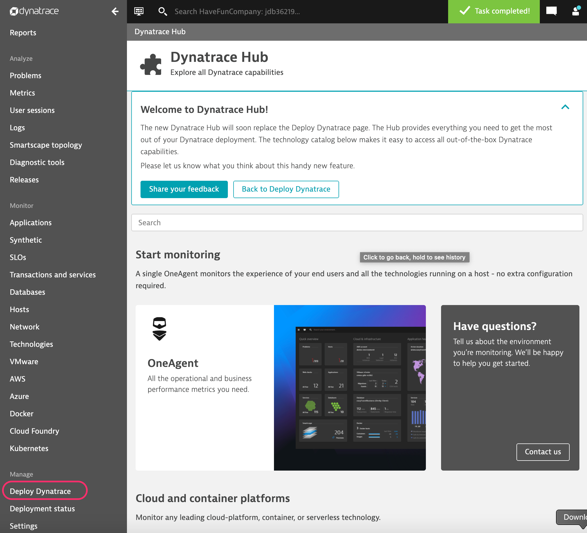
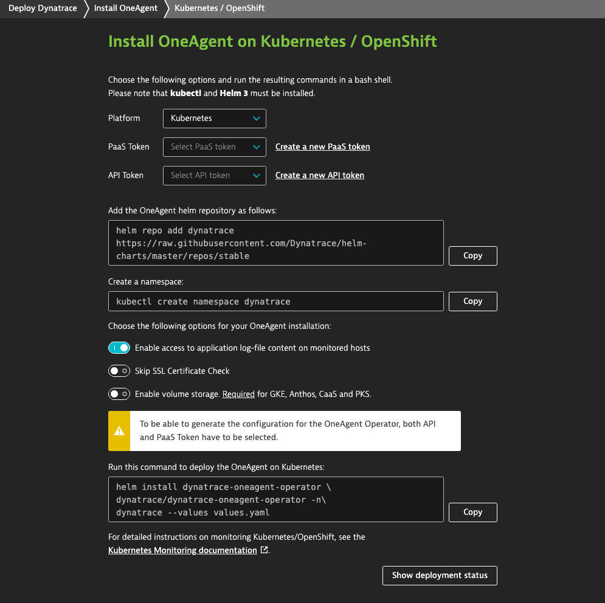
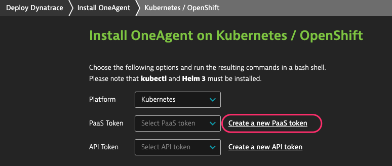
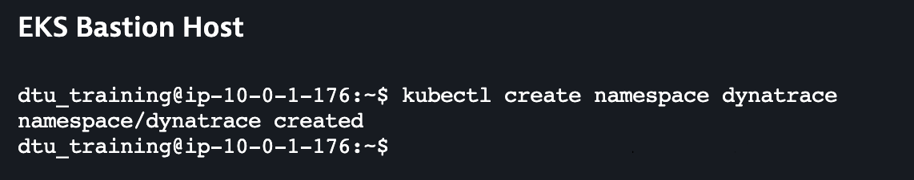

## Exercise 1: Instrumenting K8S with the OneAgent

In this exercise we will install the Dynatrace Operator for K8S utlizing a Helm Chart.

### 1. Install Helm 3 (reference: https://docs.aws.amazon.com/eks/latest/userguide/helm.html)

On your Bastion Host run the following command:
~~~~
  curl -sSL https://raw.githubusercontent.com/helm/helm/master/scripts/get-helm-3 | bash
~~~~
  

### 2. Deploy Dynatrace Operator

1. In Dynatrace tenant select "Deploy"
  
   
2. Search for kubernetes
  

3. Click on Kubernetes tile from above
  

4. Click Create PaaS token
  

After creating the PaaS token follow the step 1-3 above to get back to this screen.

5. Create API token
  

After creating the PaaS token follow the step 1-3 above to get back to this screen.

6. Select the PaaS and API tokens you created above
  

7. Add the OneAgent Helm Repository

On your EKS Bastion Host run:
~~~~
  helm repo add dynatrace https://raw.githubusercontent.com/Dynatrace/helm-charts/master/repos/stable
~~~~

  

8. Create the K8S dynatrace namespace

On your EKS Bastion Host run:
~~~~
  kubectl create namespace dynatrace
~~~~

  
 
9. In the Dynatrace Deploy Kubernetes screen: Click "Copy" to copy the values.yaml content and paste that into a new file on your Bastion host

  

10. Deploy the Oneagnet on Kubernetes

On your EKS Bastion Host run:
~~~~
helm install dynatrace-oneagent-operator dynatrace/dynatrace-oneagent-operator -n dynatrace --values values.yaml
~~~~

  

### 3. Validate Install

Run the kubectl commands in the screenshot above.
