## Instrumenting Kubernetes with Dynatrace

In this exercise we will install the Dynatrace Operator.


### 1. Deploy Dynatrace

1. In Dynatrace tenant select "Deploy"

   

2. Search for kubernetes
   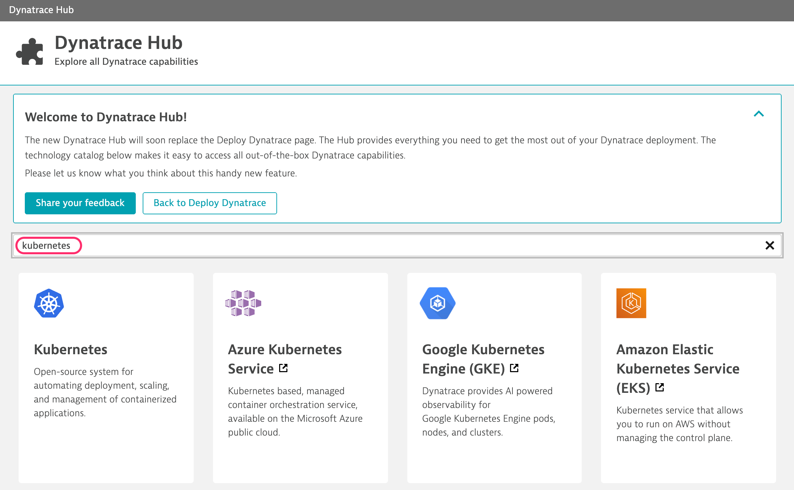

3. Click on Kubernetes tile from above
   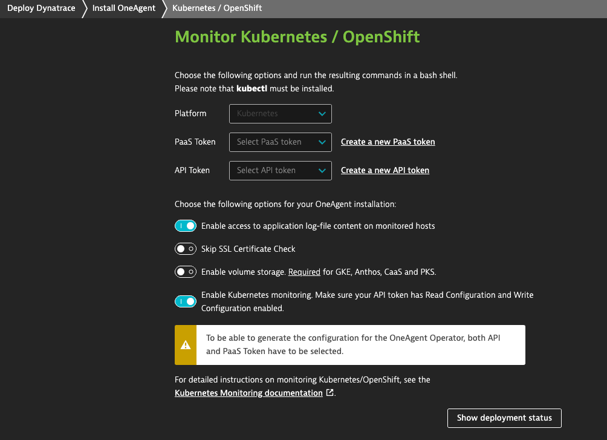

4. Click on Monitor Kubernetes
   

5. Click Create PaaS token

   

   - After creating the PaaS token follow the step 1-3 above to get back to this screen.

6. Create API token

   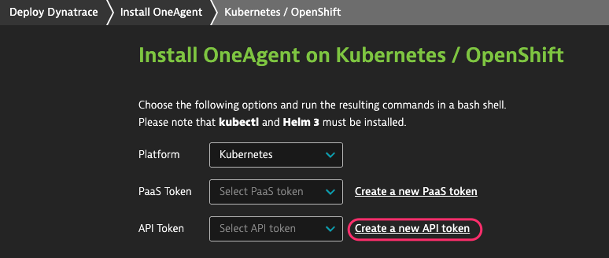

   - Make sure you have the "Access problem and event feed, metrics, and topology", "Read Configuration" and "Write Configuration" settings enabled for the API token.

   

   -After creating the PaaS token follow the step 1-3 above to get back to this screen.

7. Select the PaaS and API tokens you created above

   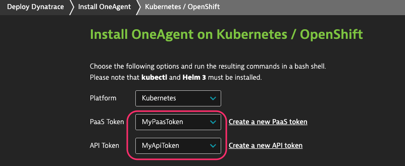

8. Click the Copy Button

   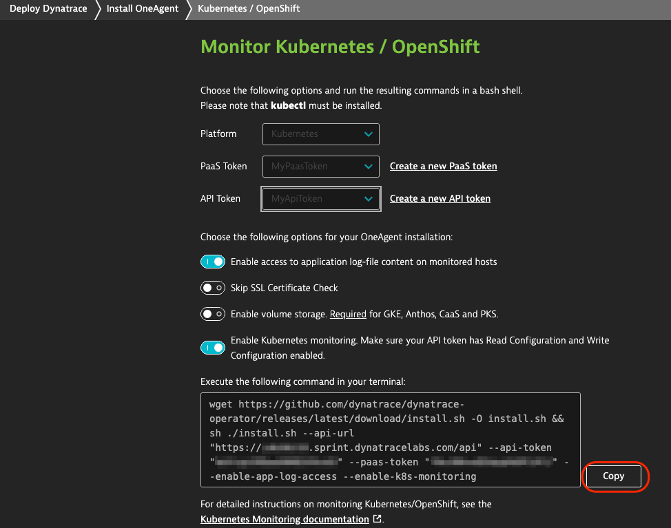

9. Run Script on Bastion host

   
   


### 2. Update Kubernetes Integration Settings
1. In Dynatrace Tenant, Click Settings -> Cloud and Virtualization -> Kubernetes

   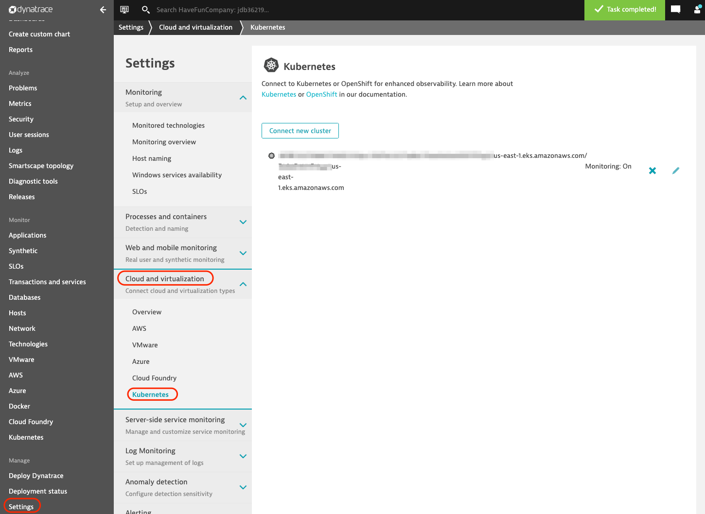


2. Click on the Edit icon for the configured K8S clustername

  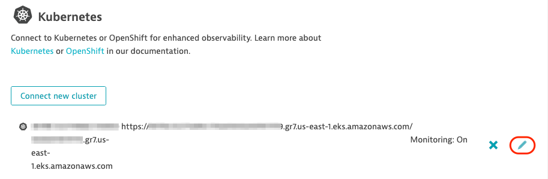       


3. Set the toggle switches
   - Toggle off "Require valid certificates for communication with API server". This is because the workshop k8s cluster are using self signed certificates.

   - Toggle on "Monitor Prometheus exports"
   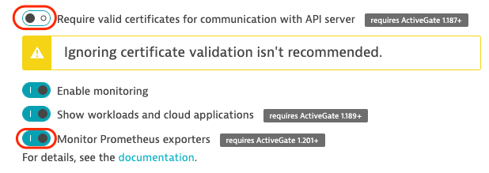

4. Click Add event field selector
   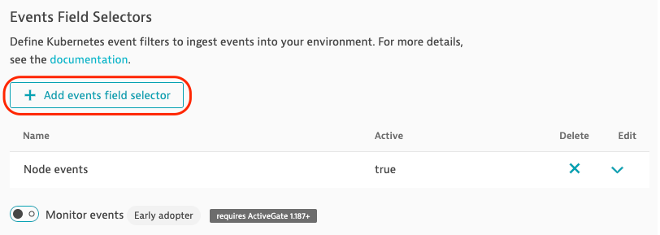

5. Add a field selector name and expression

   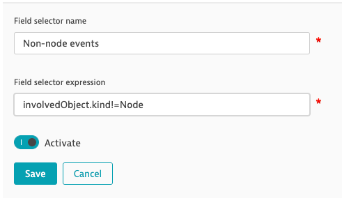

   - Field selector
   ```
   involvedObject.kind!=Node
   ```

   - Click Save.

6.  Toggle on Monitor events

   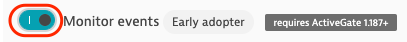

7. Click Save.   
