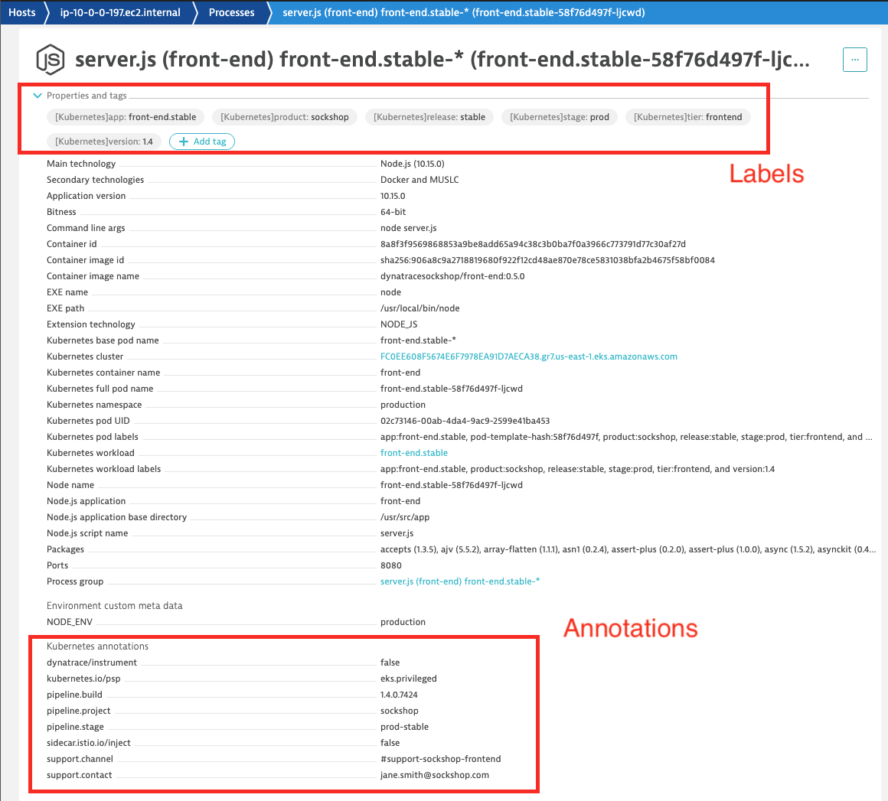

## Kubernetes Labels and Annotations
For our Hands-On, you will need to be running the sample application sock-shop deployed earlier in the labs.

### 1. Run the Sample App sock-shop
Make sure sample sockshop app is dedployed.  Navigate to the frontend service and notice the missing labels and annotations at a service level.

Once running, you can go to HotDay2021/content/Lab04/front-end.yml to view the content in it

### 2. Apply the manifest to the environment

Apply the manifest file to the environment.  
```
	$ kubectl apply -f HotDay2021/content/lab04/front-end.yml

```

### 3. Viewership role for service accounts
The OneAgent will use a pod service account to query for its metadata via the Kubernetes REST API.

The service accounts must be granted viewer role in order to have access

In the CLI, execute the following command to grant viewer role

```
	$ kubectl create rolebinding serviceaccounts-view --clusterrole=view --	group=system:serviceaccounts:production --namespace=production
```
You can repeat the procedure for the dev project

```
	$ kubectl create rolebinding serviceaccounts-view --clusterrole=view --	group=system:serviceaccounts:dev --namespace=dev
```

Wait for the Dynatrace to pickup the change. Alternatively, you can recycle the apps with k8s-workshop/recycle-sockshop-frontend.sh

### 4. Validate

Once working, you can validate the change in Dynatrace


