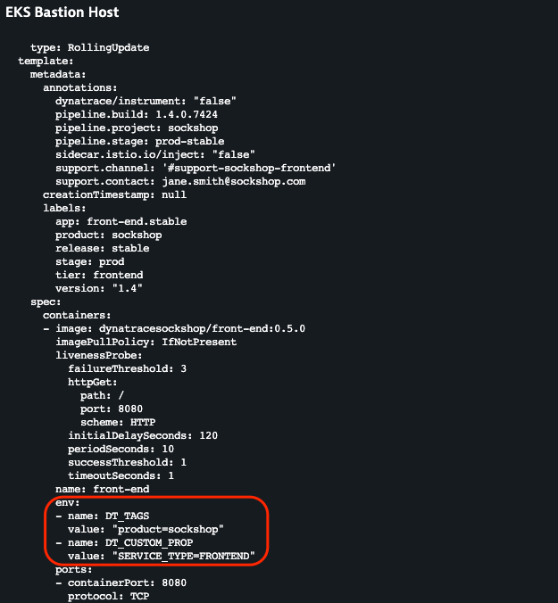

## Container Environment Variables

Dynatrace can utilize environment variables to automatically set Tags and Custom Properties. More details on on defining tags and custom properties via environment variables located here: https://www.dynatrace.com/support/help/how-to-use-dynatrace/tags-and-metadata/setup/define-tags-based-on-environment-variables/

### 1. Adding Environment variables

1. Examine the content/lab05/front-end.yml manifest file.

   ```
   cat content/lab05/front-end.yml
   ```

   )

2. Apply the front-end-env.yml file.

   ```
   kubectl apply -f content/lab05/front-end.yml
   ```

3. Restart the production front-end pods

   ```
   k8s-apps/recycle-sockshop-frontend.sh
   ```


### 2. Validate

Once working, you can validate the change in Dynatrace

[JSON](https://github.com/Nodnarboen/k8s-workshop/blob/master/assets/Picture14.png)
