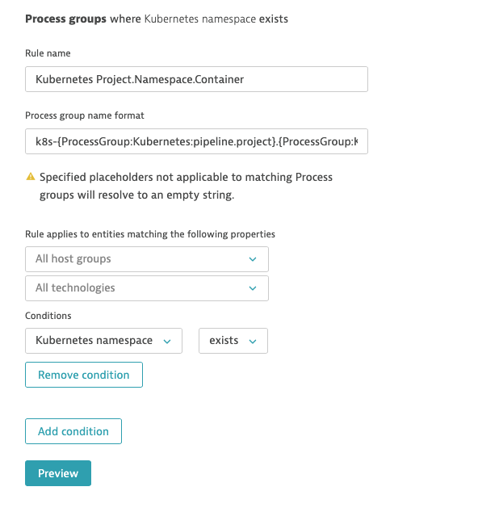
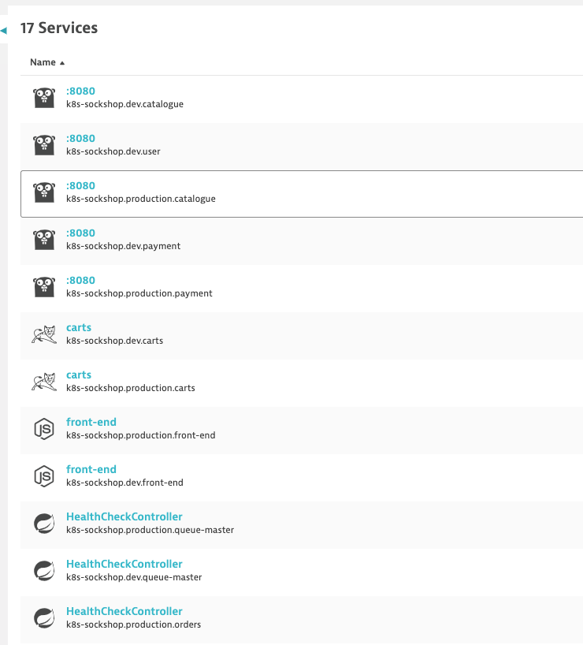
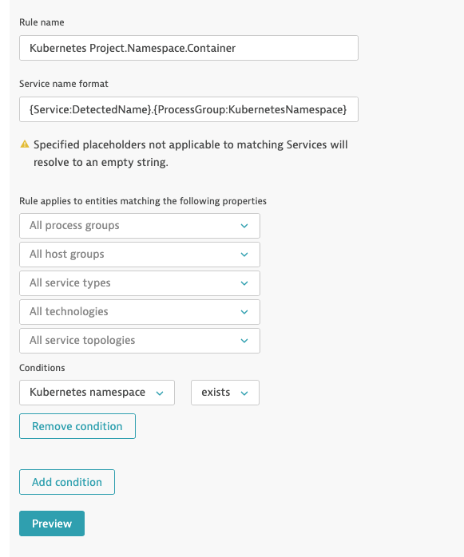
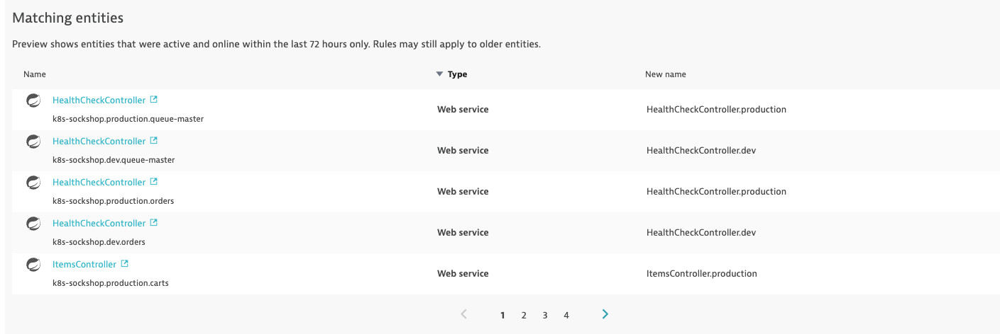
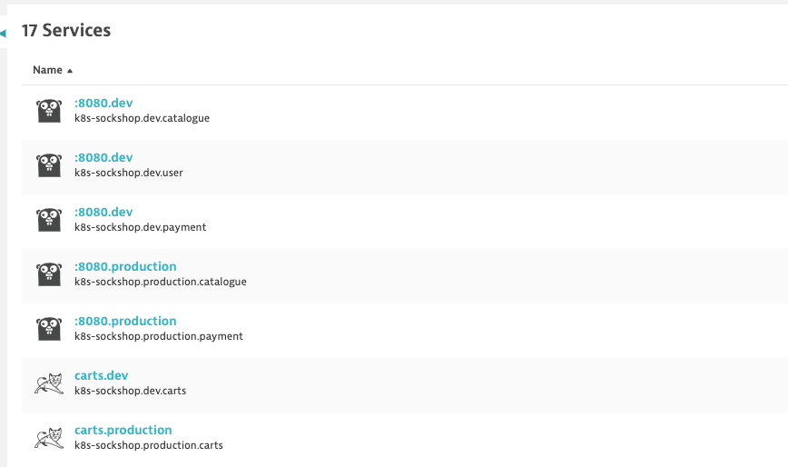

## Process Group & Service Naming Rules

### 1a. Process Group Naming Rules

Go in Settings -> Processes and containers -> Process group naming and click Add a new rule

Provide a name to the rule, for example : <b>Kubernetes Project.Namespace.Container</b>

Enter this format : <b>k8s-{ProcessGroup:Kubernetes:pipeline.project}.{ProcessGroup:KubernetesNamespace}.{ProcessGroup:KubernetesContainerName}</b>

In the conditions drop-down, select the property "<b>Kubernetes namespace</b>" and the condition "<b>exists</b>"

Click on <b>Preview</b>

Click on <b>Save</b>

### 1b. Validate

Once working, you can validate the change in Dynatrace

### 2a. Service Naming Rules

Go in Settings -> Server-side service monitoring -> Service naming rules and click Add a new rule

Provide a name to the rule, for example : <b>Kubernetes Project.Namespace.Container</b>

Enter this format : <b>{Service:DetectedName}.{ProcessGroup:KubernetesNamespace}</b>

In the conditions drop-down, select the property "<b>Kubernetes namespace</b>" and the condition "<b>exists</b>"

Click on <b>Preview</b>

Click on <b>Save</b>

### 2b. Validate

Once working, you can validate the change in Dynatrace

